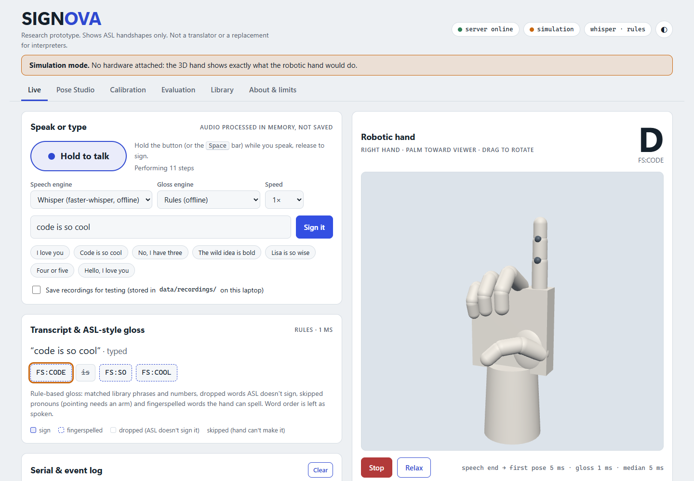
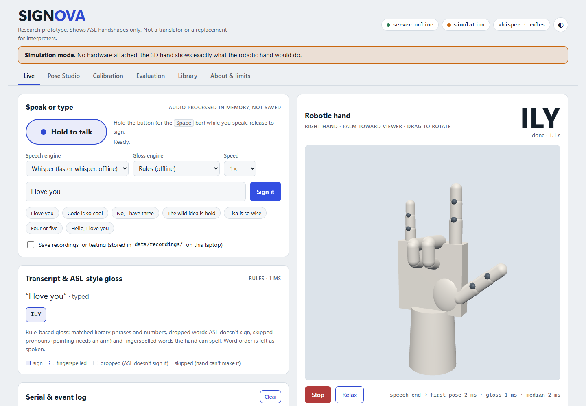
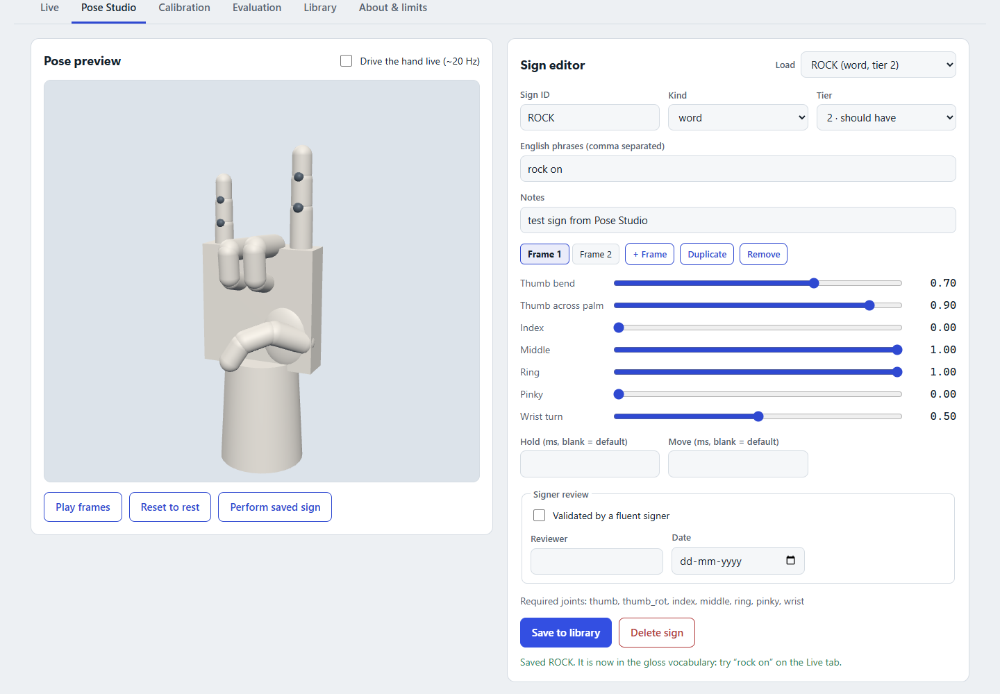
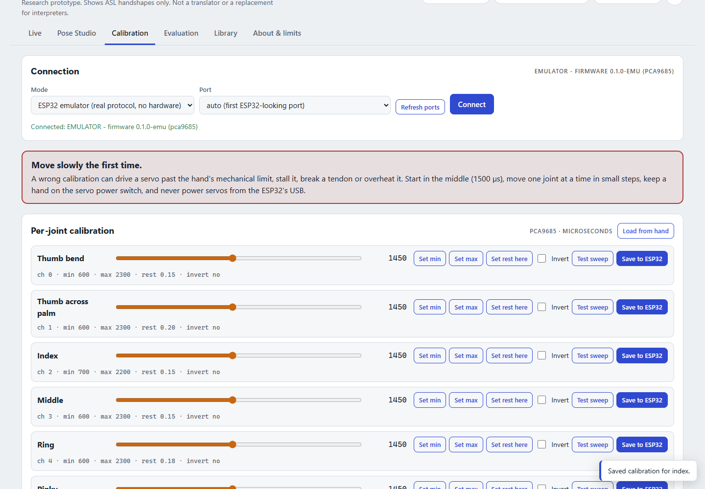
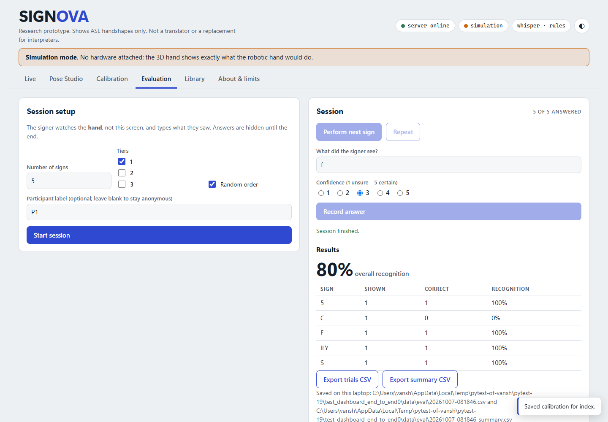
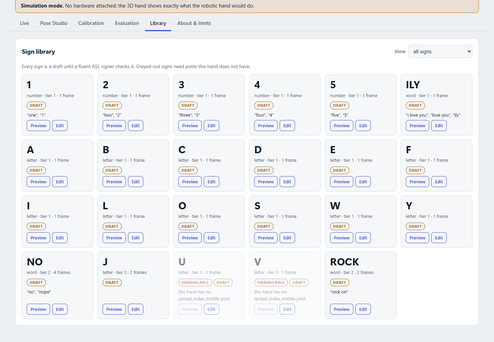
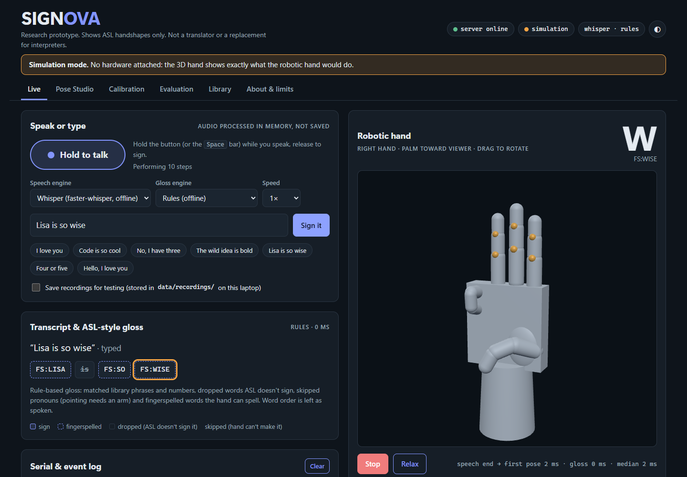

# SIGNOVA

**Speech → AI → sign representation → robotic motion.** SIGNOVA is an experimental, AI-powered,
3D-printed robotic hand. A person speaks; the laptop turns speech into text, an AI gloss step picks
ASL-style signs the hand can physically make, and an ESP32 moves the fingers.

> **Research prototype. Shows ASL handshapes only. Not a translator or a replacement for interpreters.**
> One hand, handshapes only: no facial grammar, no arm movement. See [docs/ETHICS.md](docs/ETHICS.md).

SAIT *Emerging Trends* course project, fall 2026. Everything runs in **simulation** today and plugs
into the real hand with only configuration and calibration changes.



## Quick start (Windows, 5 minutes)

Needs Python 3.11+ and Google Chrome. Node.js is not needed.

```powershell
git clone <this repo> signova; cd signova
powershell -ExecutionPolicy Bypass -File scripts\setup.ps1          # venv, dependencies, tests
powershell -ExecutionPolicy Bypass -File scripts\run_sim_demo.ps1   # opens http://127.0.0.1:8000
```

Type **I love you** and press *Sign it*: the 3D hand makes ILY. Try **code is so cool**: it
fingerspells C-O-D-E, S-O, C-O-O-L, drops "is", and shows the small bounce on the double O. Hold the
**Hold to talk** button (or Space) to speak instead. For offline speech models run the setup with
`-Models` once (≈280 MB). Details: [docs/SETUP_WINDOWS.md](docs/SETUP_WINDOWS.md).

## Connect the real hand

1. Wire it: [docs/HARDWARE_WIRING.md](docs/HARDWARE_WIRING.md) (separate servo supply, common ground).
2. Flash `firmware/signova_hand` with PlatformIO (VS Code or `pio run -e esp32dev -t upload`).
3. `powershell -ExecutionPolicy Bypass -File scripts\run.ps1 -Mode serial -Port COM5`
   (or Calibration tab → *ESP32 over USB* → Connect).
4. Calibrate every joint: [docs/CALIBRATION.md](docs/CALIBRATION.md).

No hardware yet? `scripts\run.ps1 -Mode emulator` runs a pure-Python ESP32 that speaks the exact
protocol, including calibration storage, the watchdog and error replies.

## What's inside

| Part | Where | What it does |
|---|---|---|
| Speech | `signova/speech/` | faster-whisper `base.en` (offline, CPU int8) or Vosk grammar mode (only words the hand can sign) |
| Gloss | `signova/gloss/` | rule-based engine (offline baseline) or Claude with structured outputs; a validator rejects anything the hand can't do |
| Sequencer / performer | `signova/sequencer.py`, `performer.py` | poses, holds, doubled-letter bounce, speed 0.5–2×, cancellable runs, latency logging |
| Transports | `signova/transport/` | `sim`, `emulator`, `serial_esp32` (heartbeat, auto-reconnect, joint check) |
| Server | `signova/server/app.py` | FastAPI REST + WebSocket events, serves the dashboard |
| Dashboard | `dashboard/` | Live · Pose Studio · Calibration · Evaluation · Library · About; 3D hand (three.js, vendored) |
| Firmware | `firmware/signova_hand/` | ESP32 + PCA9685 (or Feetech SCS): min-jerk motion at 100 Hz, speed limit, NVS calibration, 5 s watchdog |
| Sign library | `signs/library.yaml` | 22 draft signs: numbers 1–5, ILY, 12 letters, NO, J (wrist), U/V (need finger spread) |
| Hand configs | `config/hand*.yaml` | joint list and order, timings, transport |

Architecture and data flow: [docs/ARCHITECTURE.md](docs/ARCHITECTURE.md). Serial protocol:
[docs/PROTOCOL.md](docs/PROTOCOL.md).

## Command line

```powershell
.venv\Scripts\signova serve --sim --open          # or --emulator, or --serial COM5
.venv\Scripts\signova gloss "code is so cool"     # gloss + poses, no server
.venv\Scripts\signova check                       # validate config + library, list unavailable signs
.venv\Scripts\signova ports                       # serial ports (ESP32-looking ones marked)
.venv\Scripts\signova download-models             # Vosk lgraph + Whisper base.en into models\
.venv\Scripts\signova transcribe clip.webm        # test a speech engine on a file
.venv\Scripts\signova metrics                     # latency + evaluation numbers for the report
.venv\Scripts\signova gloss-eval -v               # gloss accuracy, rules vs Claude
.venv\Scripts\signova bench --mode emulator       # repeatability: same 10 signs × 20 runs
```

## Tests

```powershell
.venv\Scripts\python -m pytest -q        # all Python tests (speech tests with real models skip until downloaded)
.venv\Scripts\python -m ruff check .     # lint
cd firmware\signova_hand; ..\..\.venv\Scripts\pio test -e native   # firmware unit tests
```

The suite covers the gloss rules (40 reference sentences), the validator, the mocked Claude engine,
library validation and saving, sequencer timing, performer cancel/stop, every server endpoint, the
serial transport against the emulator (bad JSON, timeouts, watchdog, reconnect), a headless
end-to-end WebSocket test, speech with real models on offline-TTS audio, and a Playwright run
through every dashboard tab (screenshots in `docs/screenshots/`).

## Docs

[Setup on Windows](docs/SETUP_WINDOWS.md) · [Architecture](docs/ARCHITECTURE.md) ·
[Protocol](docs/PROTOCOL.md) · [Hardware wiring](docs/HARDWARE_WIRING.md) ·
[Calibration](docs/CALIBRATION.md) · [Sign library](docs/SIGN_LIBRARY.md) ·
[Evaluation](docs/EVALUATION.md) · [Ethics](docs/ETHICS.md) · [Handoff / what's left](docs/HANDOFF.md)

## Screenshots

| | |
|---|---|
|  |  |
|  |  |
|  |  |

## Credits and licences

faster-whisper (MIT), Vosk (Apache-2.0), three.js (MIT), ArduinoJson (MIT), Adafruit PWM Servo Driver
Library (BSD). Fingerspelling reference: Dr. Bill Vicars, lifeprint.com. Hand designs referenced in the
plan: InMoov, PARLOMA (Bulgarelli et al., 2016), Robot Nano Hand, Pollen Robotics Amazing Hand.
