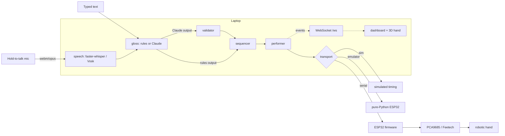

# Architecture

SIGNOVA is one Python application on a laptop plus a small firmware on an ESP32. All language
and AI work happens on the laptop. The ESP32 only receives normalised poses, plans smooth motion,
applies calibration and safety limits, and drives the servos.

```
                    ┌──────────────────────── laptop ─────────────────────────────────────┐
  microphone ──►    │ Browser dashboard (dashboard/: index.html, app.js, hand3d.js)       │
  (hold to talk)    │   Live · Pose Studio · Calibration · Evaluation · Library · About   │
                    │        │ HTTP (REST)                  ▲ WebSocket /ws (events)        │
                    │        ▼                              │                              │
                    │ FastAPI server (signova/server/app.py, 127.0.0.1:8000)              │
                    │   speech/  ── faster-whisper (default) │ Vosk grammar ("demo-safe")  │
                    │   gloss/   ── rules  │  Claude (structured output) ──► validator     │
                    │   sequencer.py ──► steps (pose vector, move_ms, hold_ms)            │
                    │   performer.py ──► one cancellable asyncio task per sentence        │
                    │   transport/ ── sim │ emulator (pure-Python ESP32) │ serial_esp32   │
                    └──────────────────────────────────────────────┬──────────────────────┘
                                                                   │ USB serial, JSON lines
                                                                   ▼ 115200 baud
                    ┌──────────────────────── ESP32 (firmware/signova_hand) ─────────────┐
                    │ protocol.cpp (parse/validate) → motion.cpp (min-jerk, 100 Hz,       │
                    │ speed limit) → calibration (NVS) → driver_pca9685 / driver_feetech  │
                    │ watchdog (5 s) · status LED                                          │
                    └──────────────────────────────────────────────┬──────────────────────┘
                                                                   ▼
                                       PCA9685 (I2C) or Feetech SCS bus → servos → hand
```



## One sentence, step by step

| # | Stage | Code | Typical time (laptop CPU) |
|---|---|---|---|
| 1 | Browser records while the button is held; on release it uploads webm/opus with the release timestamp `t_end` | `dashboard/app.js` `initTalk` | – |
| 2 | Decode with PyAV to 16 kHz mono, transcribe | `speech/audio.py`, `whisper_stt.py` / `vosk_stt.py` | Whisper base.en: ~1.5–2 s for a short sentence; Vosk: ~1.1 s |
| 3 | Gloss: phrases → words → drop → pronoun skip → fingerspell / skip; or Claude + validator | `gloss/rules.py`, `gloss/llm.py`, `gloss/validate.py` | rules < 1 ms; Claude: network-dependent, hard limit 8 s (not measured yet: no API key during the build) |
| 4 | Sequence: one step per frame / letter, bounce for doubled letters, speed factor | `sequencer.py` | < 1 ms |
| 5 | Perform: publish `step`, send the pose, wait for `done`, hold | `performer.py`, `transport/*` | – |
| 6 | The 3D hand animates the same pose over the same `move_ms` with the same min-jerk curve and speed limit | `dashboard/hand3d.js` | – |

End-to-end latency is measured from the end of speech (`t_end`) to the first pose being sent, and
logged to `data/logs/runs.csv` (numbers only, never the text). `signova metrics` summarises it.

## Concurrency model

* **One asyncio event loop** (uvicorn) runs the API, the WebSocket fan-out, the performer task and
  the serial transport's heartbeat and reconnect tasks.
* **Speech** runs in a worker thread (`asyncio.to_thread`) so a 2-second transcription never blocks events.
* **Serial reading** runs in a daemon thread (pyserial is blocking). Each complete line is handed
  to the loop with `call_soon_threadsafe`. A generation counter discards lines from a reader that
  belonged to a previous connection.
* **The emulator** runs its own 100 Hz thread, just like the firmware's `loop()`.
* `EventBus.publish` is thread-safe and drops the oldest events for slow WebSocket clients instead
  of blocking.

## Events on `/ws`

Every event is `{"type", "seq", "ts", ...}`.

| type | Payload highlights |
|---|---|
| `status` | `state`: connected / performing / transcribing / speech / stopped / relaxed / transport / library / settings / calibration; `detail`; `transport` snapshot |
| `transcript` | `text`, `source` (mic / typed), `engine`, `stt_ms` |
| `gloss` | `items[]` ({type, id, word, reason}), `note`, `engine`, `fallback`, `rejected`, `latency_ms` |
| `step` | `run_id`, `index`, `total`, `item_index`, `sign_id`, `label`, `context`, `kind` (sign/letter/bounce), `pose{joint: value}`, `move_ms`, `hold_ms` |
| `done` | `run_id`, `ok`, `reason` (finished / stopped / timeout / transport error / replaced…), `steps`, `total_ms`, `first_pose_ms` |
| `error` | `source`, `message` (friendly, never a stack trace) |
| `telemetry` | `kind`: serial (tx/rx/sys line), latency, pose, device |
| `eval` | evaluation progress (never the answer) |

Every run ends with **exactly one** `done` event.

## Configuration and data

| Path | What | In git |
|---|---|---|
| `config/hand.yaml` | joint list and order, transport mode, timings, speed limit | yes |
| `signs/library.yaml` | sign library (poses, phrases, tiers, validation status) | yes (`.bak` ignored) |
| `.env` | `ANTHROPIC_API_KEY`, `SIGNOVA_MODEL`, … | **no** |
| `models/` | Vosk and Whisper models | no |
| `data/logs/runs.csv` | per-run timing numbers | no |
| `data/eval/*.csv` | evaluation sessions | no |
| `data/emulator_cal.json` | emulator calibration | no |
| `data/recordings/` | only if "save recordings for testing" is ticked | no |

## Design decisions

* **Normalised joints everywhere.** The library, the AI and the protocol never see servo units, so
  recalibrating or swapping servos never touches signs.
* **Availability follows the hardware.** A sign's `requires` list is compared with the hand config.
  Signs the hand can't make disappear from the gloss vocabulary (and from Claude's schema enum) and
  are greyed out in the dashboard.
* **The AI is boxed in twice:** sign IDs are an `enum` in the structured-output schema, and the
  validator re-checks every item (unknown ids, missing joints, unspellable words).
* **Simulation first.** The same performer drives `sim`, the emulator and the real ESP32, so
  everything except the physical servos was built and tested without the hand.
* **No build step, no Node.** The dashboard is plain ES modules with three.js vendored (r170 is
  the last release whose `three.module.min.js` is a single file).
